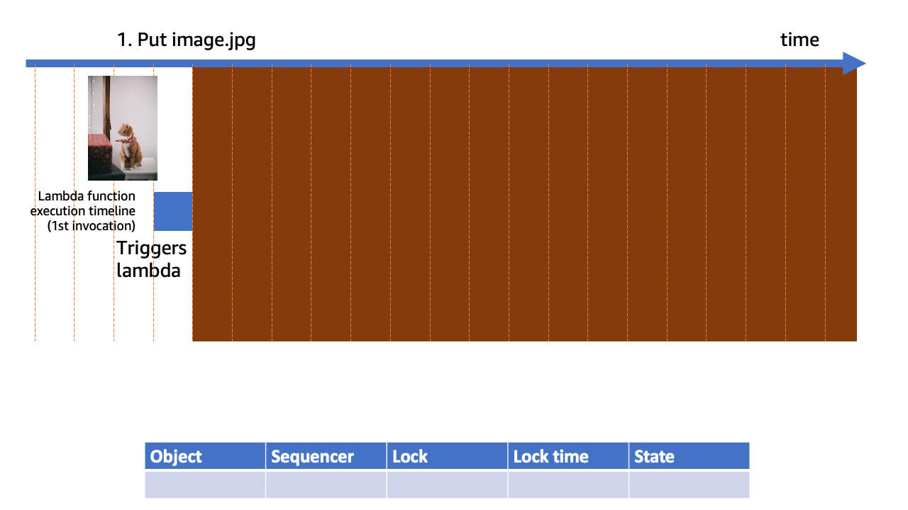

# Example of handling duplicate/unordered/concurrent EventBridge S3 events

This package provides an example, and some re-usable code, showing how to
prevent out-of-order (for a single key) or duplicate processing of S3 event
notifications triggered by EventBridge.  It also implements locking so that if
multiple instances of a function are invoked concurrently, the latest update
wins.

Note that ordering across notifications for multiple S3 objects is not possible
at the time of writing this and this example focusses on operations against a
single object.

Ordering and locking is achieved by maintaining a secondary index of the bucket
in DynamoDB and tracking the last-seen "sequencer" for each key.

Note that this sample does not create an ordering of notifications.  Instead, it
skips handling of a notification if it is older than one that has already
completed.  Thus, not every update is necessarily processed.

### Sample code notes

The sample code; software libraries; command line tools; proofs of concept;
templates; or other related technology (including any of the foregoing that are
provided by our personnel) is provided to you as AWS Content under the AWS
Customer Agreement, or the relevant written agreement between you and AWS
(whichever applies). You should not use this AWS Content in your production
accounts, or on production or other critical data. You are responsible for
testing, securing, and optimizing the AWS Content, such as sample code, as
appropriate for production grade use based on your specific quality control
practices and standards. Deploying AWS Content may incur AWS charges for
creating or using AWS chargeable resources, such as running Amazon EC2 instances
or using Amazon S3 storage.”

## What's in the package

This is a SAM (Serverless Application Model) application containing a full
example with input, output, and test input buckets, the notification handler
(Lambda function) itself, and permissions setup.

There is also a sample client that allows you to manually exercise the example
and see the result of using or disabling the use of the secondary index.

Finally, there are integration tests you can run from your local computer that
validate the example is working correctly by injecting unordered, duplicate, and
in-order events.

### The SAM application

The substance of this application is the notification handler Lambda function.
This handles event notifications received from EventBridge in response to
objects being created in the input bucket.  It reads the object as an image,
inverts it, and then writes it back out to the output bucket under the name
`out-\<input key\>`.

If we assume that input keys can be overwritten, then in our event notification
handler we have to be careful to handle mutual exclusive access to the keys.
It's also possible that events can be triggered out-of-order (although note that
an event only contains metadata about an object and not the data itself) and
that duplicate events can be received.

The section below, "How does it work?", delves into how we solve this problem in
more depth.

In summary, the application consists of:

1. The event notification handler Lambda function (the code for this is in the
   `endedupe` folder).  This includes a reusable `S3Lock` implementation that
   tracks locks against keys in the input bucket in the secondary index DDB
   table, as well as unit tests with full coverage of this.
2. Input, test input (for integration testing), and output buckets.
3. A DynamoDB table for storing the secondary index with lock information.

### Integration tests

The integration tests are in the `endedupe_integ_test` folder.

The integration tests are a simple set of pytest tests that set up test
scenarios by placing data in the test input bucket and then generating the event
notification "manually" by invoking the lambda function directly.  This is
needed because there are scenarios that we can't provoke using the regular S3
interface directly, such as an out-of-order or duplicate event notification
being generated.  The test therefore simulates this to check that the
notification handler behaves correctly.

### The sample client

The sample client is in the `sample_client` folder.

The sample client uploads a set of images to the input bucket, downloads the
transformed outputs, and creates a montage so you can visually see the effect of
using or disabling the secondary index used for performing locking of input keys
when handling the notification.

## Deploying and exercising the example

### Deploying the example

To deploy the sample to your AWS account, you will need the SAM CLI installed.
You will be billed for resource usage in your account.

See [Installing the AWS SAM
CLI](https://docs.aws.amazon.com/serverless-application-model/latest/developerguide/install-sam-cli.html)
for more information on how to install the SAM CLI on your platform.  As the
example uses Python, to run tests and the client locally you will need Python 3
installed.  The sample code has been tested with Python 3.9.

For all of this to work, you'll also want to install a working AWS CLI and make
sure that you have configured your credentials.  For more information, see
[Installing or updating the latest version of the AWS
CLI](https://docs.aws.amazon.com/cli/latest/userguide/getting-started-install.html)

To build the artefacts for deployment, run `sam build`.

To deploy, run `sam deploy --guided`.  **Note** The local tests assume that the
CloudFormation stack name is "eventbridge-blog" so if you plan to run these
tests then you should choose this as the stack name.

### Running the integration tests

The integration tests are in the `endedupe_integ_test` directory and have a
separate `requirements.txt`.  You can make a virtual environment for them and
run them from there, but you must first deploy the SAM application to your
account.  The tests will interact with the CloudFormation stack deployed to your
account and use the outputs it defines to find the test input bucket and output
buckets.

Here's an example of how to run the tests.  Make sure that a simple `aws` CLI
command works first, so you know your credentials are set up correctly (e.g.
`aws s3 ls`):

```sh
python3 -m venv venv
. venv/bin/activate
pip install -r requirements.txt
pytest
```

### Using the sample client

The sample client demonstrates the problem and how this implementation resolves,
as described in our blog post.  To use the sample client, you need to have
deployed the application to your AWS account as described above, have the AWS
CLI on your PATH, and have ImageMagick installed if you want to see the output
montage.

The shell script `sample_client/run.sh` is a wrapper that you can use to upload
a series of images in sequence either with the locking safeguards/secondary
index enabled or disabled to see how it can protect against unordered or
concurrent invocations of the test lambda function.

The endedupe Python virtual environment should have the needed dependencies to
run the sample client using the "run.sh" script.  To run the sample client you
can use the following commands, assuming you are in the root of the repository:

```sh
cd endedupe
python3 -m venv venv
. venv/bin/activate
pip install -r requirements.txt
cd ../sample_client
./run.sh
```

The "run.sh" script uses the "montage" command from ImageMagick to create the
montage of processed images.

If you run "run.sh" without any options, you should see a montage of all cat
images. If you add the `-n` option, with some probability, you will see a
montage that includes some cat images.  These are always uploaded first but
because of the order the notifications are handled can appear out-of-order in
the output.

## How does it work?

The main logic is in the `s3index.py` file.  The main entrypoint is
`handle_notification_if_up_to_date`.

The example uses a table in DynamoDB to track the state of object processing
when event notifications are processed.  The "sequencer" is a field in the event
notification payload that can be lexicographically compared such that newer
sequencer values represent newer mutations to the given object.  This does have
some caveats: the value is emitted only for a subset of event types, and only
some mutation types will update it.  These are: s3:ObjectCreated:*,
s3:ObjectRemoved:*, and s3:LifecycleExpiration:*.  The sequencer values from
other event types should not be used nor compared with values from the event
types listed above.  Sequencers are specific to an object name (key) and cannot
be compared at a wider scope such as between different objects, different
version of an object (these are effectively separate objects), buckets, or
across accounts.

The example first checks whether the last-seen/recorded sequencer for a key is
less than the one we're current processing and the row is not locked.  If it is,
we try to _conditionally_ update the row to mark it locked _if_ the sequencer
hasn't been updated.  If we fail this conditional write, we retry the whole
process.

Once the lock is acquired we call the processing function that, in this case,
reads the object as an image file, inverts its colors, and writes the result to
an output bucket.

Finally, when processing is complete, we release the lock.

### Example execution timelines

This sequence depicts one of the execution timelines that we seek to protect:
concurrent invocations of the notification attempting to write to the same
output.



## Tradeoffs and alternatives

### Timing out the lock

This example has no mechanism to time out a lock, and it is possible for a lock
to be held when the lambda function exits if there is enough contention on a
single object, or processing of a single object is long relative to the lambda
function timeout.

A solution to this could be to add another field to the table with an expiration
time for the lock.  Then, either the time-to-live (TTL) feature of DynamoDB
could be used to remove these locks when they expire, or the function itself
could consider a key with an expired lock as unlocked.

The difficulty with an approach including a timeout is it relies on a guarantee
that the function that took the lock will not get revived.  AWS Lambda supports
timeouts for functions which support this functionality, but in general
guaranteeing that execution of processing has absolutely and permanently stopped
is hard.

Alternatively (and in the example implementation), if the lock cannot be
acquired the function execution will be considered to be failed.  Lambda can be
configured to retry the function, and eventually post a message to a dead-letter
queue so that some other intervention can be made such as an operator examining
the situation and potentially manually releasing the lock.

None of these solutions are perfect and have a trade-off along the lines of
durability/correctness vs. liveness.

The incidents of problems like these can be minimized by making sure that the
function timeout is long enough.  Lambda also provides a way to get an estimate
of the time remaining before the timeout will occur (see the [documentation on
the context
object](https://docs.aws.amazon.com/lambda/latest/dg/python-context.html)); so a
function can abandon processing if the timeout won't leave enough time for it to
complete.  Alternatively, a second thread could be started that forcibly aborts
the processing to make sure that the function has the opportunity to release the
lock.

### Delay queue

In this example, when we cannot get the lock because it's already held, we
perform a random backoff and then retry.  This approach might be reasonable when
there is likely to be little contention for the lock and processing is fast,
however we are continuing to use the Lambda function resource to do this
waiting.  Another option would be to re-insert the event into SQS with a delay,
and then free up the function.  This could allow for longer delays, and for the
function to exit so not to be taking up resources (that you are billed for).

### Versioning

When versioning is enabled on the source bucket, each new object upload becomes
a new object in the bucket.  S3 will generate unique events for the versions,
and their sequencers will not be safe to compare across other versions of the
same object.

This helps with the concurrency issue: now objects don't get overwritten as in
the example, but there's no way to control the order a version stack in the
destination bucket.  This leaves either having uniquely-named objects in the
destination (and some way of communicating version order to the recipient, since
version IDs are not monotonically increasing), or back to solving the original
problem of the destination object being overwritten.

That being said, enabling versioning in the destination will allow recovery of
intermediate states, if this is desireable.

### Cleanup of the locking table

When objects are deleted, the example does not remove them from the DynamoDB
locking table.  This is important because it allows ordering of a create and
delete operation for the same object name; however, it means the lock table will
grow indefinitely as no entries are removed.

One option to fix this is to add a TTL column to the table, and use DynamoDB's
TTL feature to expire items that are old.  For example, you could remove items
after a week or longer.  There is a trade-off that if your application processes
a very late event then it could process a create or other operation that
preceded the delete that was recorded in the table and subsequently removed.
